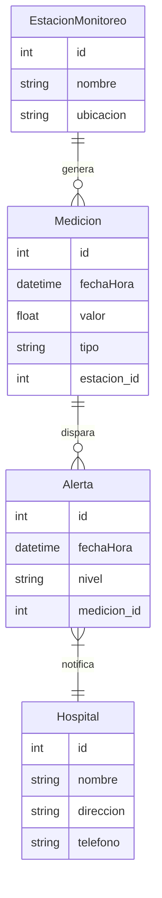

## **Guía para Crear Diagramas ER con IA: De la Problemática a la Solución**  
**Caso de Estudio:** Ejemplo con proyecto de Calidad del Aire en Bogotá  
**Herramientas:** ChatGPT (IA), PostgreSQL, Datos Abiertos Bogotá  

---

Primero crear una carpeta en projects con el nombre del proyecto, por ejemplo `00_air_quality_geomonitoring`. Dentro de esta carpeta, organiza tus archivos siguiendo la estructura sugerida en la sección final de esta guía.

---

## Tabla de entregables:

A continuación se muestra una tabla con los entregables sugeridos, organizada por cada etapa del proyecto y con una breve descripción de cada archivo o carpeta:

| **Paso**                        | **Entregable (Archivo/Carpeta)**                  | **Descripción**                                                                                                                     |
|---------------------------------|---------------------------------------------------|-------------------------------------------------------------------------------------------------------------------------------------|
| **1. Entender el Problema**     | `docs/problem_analysis.md`                       | Reporte de investigación que describe el problema, causas, actores y fuentes de datos.                                              |
|                                 | `docs/sources_analysis.md`                        | Resumen y validación de fuentes oficiales y referentes utilizados.                                                                  |
| **2. Definir Requisitos**       | `docs/system_requirements.md`                      | Documento con las user stories, requisitos funcionales y no funcionales, y visión general del sistema.                                |
|                                 | `docs/functionalities_prioritization.md`            | Matriz de impacto vs. complejidad y priorización de funcionalidades.                                                                |
| **3. Identificar Entidades y Atributos** | `docs/entities_attributes.md`              | Listado y descripción de las entidades y atributos propuestos, validando su pertinencia con datos reales.                              |
|                                 | `docs/data_validation.md`                        | Informe que relaciona los elementos teóricos con la disponibilidad de datos.                                                        |
| **4. Diseñar Relaciones**       | `docs/er_diagram.md`                              | Diagrama Entidad-Relación en formato Mermaid o similar, utilizando notación Crow's Foot.                                              |
|                                 | `docs/relationship_decisions.md`                   | Justificación y explicación de la lógica detrás de las relaciones definidas entre entidades.                                         |
| **5. Normalización Asistida por IA** | `docs/normalization.md`                      | Informe del proceso de normalización, detallando la transformación de tablas para eliminar redundancias.                             |
| **7. Documentar el Uso de IA**  | `docs/ia_audit/prompts_used.md`                 | Historial de prompts y ejemplos de código generado por IA, junto con las modificaciones realizadas.                                  |

---

### **Paso 1: Entender el Problema (Contexto Real)**  
**Objetivo:** Identificar causas, actores y datos disponibles.  

Comprender el problema es el primer paso fundamental para cualquier proyecto. Antes de diseñar una base de datos, es crucial definir qué se quiere modelar y por qué. Este paso permite conocer las causas del problema, los actores involucrados y los datos disponibles para el análisis. Sin un entendimiento claro, cualquier solución sería superficial y podría no ajustarse a las necesidades reales.

Usa fuentes oficiales y diversos puntos de vista para entender mejor la problemática. Una investigación sólida mejora la calidad del modelo de datos. Si no encuentras datos en la ciudad de Bogotá, busca en otras ciudades de Colombia o del mundo, esto te dará una idea de cómo se ha abordado el problema en otros lugares y qué datos son relevantes.

**Actividades:**  
1. **Investigar con IA:**  
   ```  
   Prompt en ChatGPT:  
   "Actúa como un ingeniero ambiental. Lista 5 causas principales de la contaminación del aire en Bogotá y qué datos se necesitan para monitorearla"  
   ```  
   *Ejemplo de respuesta útil:*  
   - Causa 1: Emisiones vehiculares (54% PM2.5) → Datos: Flujo vehicular por vía.  
   - Causa 2: Quemas agrícolas en la Sabana → Datos: Imágenes satelitales de incendios.  

2. **Analizar Datos Abiertos:**  
   - Revisar [datosabiertos.bogota.gov.co](https://datosabiertos.bogota.gov.co/):  
     - ¿Qué datasets existen? (ej: "Calidad del Aire", "Hospitalizaciones por IRA").  
     - ¿Qué atributos contienen? (ej: coordenadas, PM2.5, fecha).  

**Justificación:**  
➔ *Sin entender las causas reales y datos disponibles, el modelo será teórico. La IA acelera la investigación inicial, pero debes validar con fuentes oficiales.*  

---

### **Paso 2: Definir Requisitos del Sistema**  
**Objetivo:** Traducir el problema a necesidades técnicas.  

Una vez que se comprende el problema, es necesario definir qué espera lograr el sistema. Para ello, se utilizan técnicas como las "user stories", que ayudan a establecer funcionalidades clave desde la perspectiva del usuario final. Este paso es vital porque asegura que el diseño del modelo ER se enfoque en resolver necesidades concretas y no solo en almacenar datos sin una estructura lógica.

Las "user stories" son una forma efectiva de comunicar los requisitos del sistema y priorizar las funcionalidades. Estas historias describen cómo un usuario interactuaría con el sistema y qué resultados espera obtener. Al generar estas historias, se puede identificar qué entidades y atributos son necesarios para satisfacer las necesidades del usuario.

Prioriza las funcionalidades con la matriz impacto-esfuerzo para asegurarte de que el modelo sea viable y escalable. Al final de este paso, tendrás una lista clara de lo que el sistema debe hacer y cómo se relacionan las diferentes partes.

**Actividades:**  
1. **Generar User Stories con IA:**  
   ```  
   Prompt:  
   "Genera 3 user stories para un sistema de monitoreo de calidad del aire en Bogotá. Ejemplo: Como ciudadano, quiero..."  
   ```  
   *Ejemplo de resultado:*  
   - "Como epidemiólogo, necesito correlacionar picos de PM2.5 con hospitalizaciones semanales por distrito".  

2. **Priorizar Funcionalidades:**  
   - Usar matriz de impacto vs complejidad:  
     | Alta Prioridad | Baja Prioridad |  
     |----------------|----------------|  
     | Alertas automáticas por SMS | Predicción a 30 días |  

**Justificación:**  
➔ *Las user stories ayudan a enfocar el modelo ER en lo esencial. La IA sugiere casos de uso, pero tú defines el alcance realista.*  

---

### **Paso 3: Identificar Entidades y Atributos con IA**  
**Objetivo:** Listar componentes clave del modelo.  

Las bases de datos están compuestas por entidades y atributos que representan los datos esenciales del sistema. Determinar cuáles son estas entidades y sus características es clave para garantizar que el modelo de datos refleje la realidad del problema que se desea abordar. La IA facilita este proceso al generar listas preliminares, pero la selección final debe basarse en la pertinencia y la disponibilidad de datos reales.

Las entidades deben ser significativas para el problema y los atributos deben ser relevantes para las funcionalidades definidas en las user stories. Este paso sienta las bases para el diseño del modelo ER y la posterior implementación en SQL.

No agregues entidades innecesarias. Si un dato no está alineado con los requisitos del sistema, es mejor omitirlo. La calidad de la base de datos radica en su capacidad para responder a las necesidades del usuario final.

**Actividades:**  
1. **Brainstorming de Entidades:**  
   ```  
   Prompt en ChatGPT:  
   "Lista 10 entidades para una base de datos de calidad del aire en Bogotá. Incluye atributos clave para cada una."  
   ```  
   *Ejemplo de salida:*  
   - **EstaciónMonitoreo** (ID, Ubicación, FechaInstalación)  
   - **Alerta** (ID, Nivel, FechaHora, AcciónTomada)  

2. **Filtrar Entidades:**  
   - ¿Cuáles responden a las user stories?  
   - Ejemplo: Descartar `Vehiculo` si el foco es en mediciones, no en fuentes.  

**Justificación:**  
➔ *La IA acelera la generación de ideas, pero solo el 40% serán relevantes. Cruza siempre con los datasets reales.*  

---

### **Paso 4: Diseñar Relaciones (Usando IA y Datos Reales)**  
**Objetivo:** Conectar entidades de forma lógica.  

Las relaciones entre entidades permiten estructurar la información de manera eficiente. Un modelo relacional bien diseñado evita la redundancia y mejora la coherencia de los datos. Aunque la IA puede sugerir relaciones, estas deben ser validadas con datos reales para evitar errores conceptuales, como relaciones innecesarias o cardinalidades incorrectas.

Usa código mermaid y notación crow's foot para visualizar las relaciones de forma clara. Esto facilita la implementación posterior en SQL y asegura que el modelo sea comprensible para otros desarrolladores.

**Actividades:**  
1. **Generar Relaciones con IA:**  
   ```  
   Prompt:  
   "¿Cómo se relacionan estas entidades? EstaciónMonitoreo, Medicion, Alerta, Hospital. Usa codigo mermaid y notación crow's foot."  
   ```  
   *Ejemplo de respuesta:*  
   Aquí tienes un diagrama en código **Mermaid** utilizando notación **Crow's Foot** para representar la relación entre las entidades:  


```markdown
### Explicación de las relaciones:
1. **EstaciónMonitoreo - Medición:**  
   - Una **EstaciónMonitoreo** puede generar **muchas Mediciones** (relación 1 a muchos).
   - Una **Medición** pertenece a **una sola EstaciónMonitoreo**.

2. **Medición - Alerta:**  
   - Una **Medición** puede generar **varias Alertas** (relación 1 a muchos).  
   - Una **Alerta** se asocia con **una sola Medición**.

3. **Alerta - Hospital:**  
   - Una **Alerta** puede **notificar a un solo Hospital** (relación 1 a 1 o 1 a muchos).  
   - Un **Hospital** puede ser notificado por **muchas Alertas**.

¿Te gustaría añadir más detalles o relaciones? 🚀
```

2. **Validar con Datos Reales:**  
   - Ejemplo: Si el dataset de hospitales no incluye capacidad de urgencias, elimina esa relación.  

**Justificación:**  
➔ *Las relaciones propuestas por IA pueden ser incorrectas (ej: N:M sin tabla puente). Verifica con los datos disponibles.*  

---

### **Paso 5: Normalización Asistida por IA**  
**Objetivo:** Eliminar redundancias y anomalías.  

La normalización es un proceso crítico en el diseño de bases de datos, ya que mejora la eficiencia y previene problemas de redundancia. Existen varias formas normales (1FN, 2FN, 3FN) que permiten estructurar los datos de manera óptima. La IA puede sugerir maneras de dividir tablas y reorganizar atributos, pero siempre se debe evaluar si los cambios propuestos mejoran realmente la calidad del diseño.

No sobre-normalices. Si la normalización complica excesivamente las consultas, considera mantener algunos atributos juntos para mejorar el rendimiento.

**Actividades:**  
1. **Consultar a la IA:**  
   ```  
   Prompt:  
   "¿Cómo normalizar esta tabla? Estacion(ID, Nombre, Medicion1, Medicion2, Comuna)"  
   ```  
   *Respuesta esperada:*  
   - Crear tablas separadas: `Estacion`, `Medicion` (con FK a Estacion).  

2. **Aplicar 3FN Manualmente:**  
   - Antes: `Alerta(ID, PM25, Accion)` → Después: `Alerta(ID, MedicionID, AccionID)` + `Accion(ID, Tipo)`  

**Justificación:**  
➔ *La IA da pautas generales, pero la normalización depende del contexto real. Valida con ejemplos de datos bogotanos.*  

---

### **Paso 6: Documentar el Uso de IA**  
**Objetivo:** Mantener transparencia académica.  

El uso de IA en proyectos académicos y profesionales debe ser transparente. Documentar cómo se utilizaron herramientas de IA, qué sugerencias se tomaron y cuáles fueron modificadas ayuda a comprender el aporte real del estudiante o profesional en el proyecto. Esta práctica también fomenta un uso ético de la tecnología y facilita la revisión de decisiones tomadas a lo largo del desarrollo del modelo.

**Actividades:**  
1. **Crear Archivo `IA_Usage.md`:**  
   ```markdown  
   ## Uso de IA en el Proyecto  
   ### Prompt 1:  
   - **Objetivo:** Generar user stories.  
   - **Código/Texto Original:** [captura].  
   - **Modificaciones:** Añadimos restricción de distritos priorizados por la Secretaría de Ambiente.  
   ```  

**Justificación:**  
➔ *Sin documentación, no se puede evaluar tu aporte real vs el de la IA. Es clave para la integridad académica.*  

---

## Estructura de Carpetas

```bash
projects/
│
├──00_air_quality_geomonitoring/         # Nombre del proyecto (ej: air_quality_geomonitoring)
│    ├── data/
│    │   └── raw/                        # Datos originales (CSV, GeoJSON, Shapefiles)
│    │       ├── estaciones_ideam.csv    # Datos crudos de 14 estaciones (ID, nombre, lat, lon)
│    │       └── hospitalizaciones.json  # Registros de salud 2023-2024
│    │
│    ├── docs/                           # Documentación
│    │   ├── problem_analysis.md         # Análisis de la problemática
│    │   ├── sources_analysis.md         # Fuentes de datos y validación
│    │   ├── system_requirements.md      # Requisitos del sistema
│    │   ├── functionalities_prioritization.md  # Priorización de funcionalidades
│    │   ├── entities_attributes.md      # Entidades y atributos
│    │   ├── data_validation.md          # Validación de datos
│    │   ├── er_diagram.md              # Modelo Entidad-Relación mermaid
│    │   ├── relationship_decisions.md   # Justificación de relaciones
│    │   ├── normalization.md            # Proceso de normalización
│    │   │
│    │   └── ia_audit/                  # Uso de IA
│    │       ├── prompts_used.md      # Historial de prompts, Ej: "Genera función SQL para promedio semanal PM2.5"
```

---

**⚠️ Consejo Final:**  
La IA es un **asistente**, no un reemplazo. Tu valor está en:  
1. **Validar** sus sugerencias con datos reales.  
2. **Adaptar** los modelos genéricos al contexto bogotano.  
3. **Innovar** donde los datasets tengan vacíos.  

